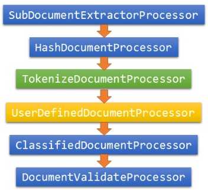

# document processor 插件介绍 #

## 概述 ##

用户可以通过编写及使用 document processor 插件来对文档进行自定义处理。插件可以对文档进行改写，分词等。

* 系统提供内置插件 TokenizeDocumentProcessor 来分词，并生成分词后的 TokenizeDocument，插件可获取到分词结果，并对词做处理。用户也可以通过配置选择不用系统提供的 TokenizeDocumentProcessor分词，自己编写分词插件，并将结果存入 TokenizeDocument中。例如，用户可在系统外部事先对原始文档分词并以指定分隔符分隔单词，在插件中按照分隔符读取分词结果，并存入 TokenizeDocument 中。
* 支持对词的处理包括：设置 TermDocPayload、TermPayload、positionPayload，对 field 分 section 及设置权重，设置词为 stopword，插入一个词，删除一个词。

## 处理流程 ##

文档处理一般经历三个步骤：分词、对词作处理、构建 field。



图中蓝色的为内置不可配插件, 会直接创建到 Document Processor Chain 上。绿色为内置可配插件，黄色为用户自定义插件。

### SubDocumentExtractorProcessor ###
处理子文档的插件, 当 schema 中有子文档相关配置时会自动加到 Document Processor Chain 头, 一般不开启。

### HashDocumentProcessor ###
通过设置 `ProcessedDocumentPtr` 中的 `DocClusterMeta` 来控制文档被发往哪个 cluster 以及 partition, 默认会发往所有 `Document Processor Chain` 中配置的 cluster, 并按照配置的 `hash_field` 和 `hash_function` 进行 hash 设置发往的 partition。默认 HashDocumentProcessor 会放在 Document Processor Chain 头部，用户可以自己实现插件对其进行覆盖。

### TokenizeDocumentProcessor ###
* 内置可配插件, TokenizeDocumentProcessor 只对类型为 TEXT，或者需要进入倒排索引(index)的字段分词。
* 如果用户不想使用 TokenizeDocumentProcessor，则要在插件中对需要进入 index 的字段分词。

### ClassifiedDocumentProcessor ###
该类为整个处理链中必走的一个内嵌模块，用户不需配置。其主要负责对用户没有处理的 field 进行处理，并最终构建一个 indexDocument。对于没有构建的倒排索引（index）字段，他读取 TokenizeDocument 中的分词结果，用非 stopword 的单词构建一个 field。对于 Attribute 字段，直接从 RawDocument 中获取相应字段的值来作为该字段的值。summary 字段的构建则分成两种：如果是 TEXT类型的字段，则从 TokenizeDocumet 中顺序读取基本链（一条存储基本检索单元的单词链）上的单词构建 summary 的相应 field，单词间以“\t”分隔；如果是非 TEXT 类型的字段则直接从 RawDocument 中获取原值作为该字段的值。

### DocumentValidateProcessor ###

对文档有效性进行验证. 会丢掉以下非法文档.

* schema 中配置了 pk, 但是文档中没有。
* ADD 文档没有 index field 且没有 pk。
* UPDATE, DELETE, DELETE_SUB 没有 pk。
* 不识别的文档操作类型。

## 内置可配插件 ##

### TokenizeDocumentProcessor ###
* 负责对原始文档RawDocument 的 TEXT 类型字段以及要建倒排索引（index）的字段（field）进行分词，分词后的结果存入TokenizeDocument中。
* 依据原始文档中的分节符对字段进行分节， 如果有节的权重则读取并设置。假如存在 TEXT 类型的 field，其值为 `我爱菊花茶^\10^]0 abc^\^]ccc`，则该 field 将被分成3节。第一节的分词结果为 `{"我", "爱", "菊花", "茶:花茶"}`，权重为10；第二节分词结果为 `{"0"," ", "abc"}`，权重为 0；第三节分词结果为 `{"ccc"}`，权重为 0。如果用户不配置该项，则相应功能由外部插件完成。
* 节权重标志为：`^\（8进制编码为\034）` ，分节标志为：`^]（8进制编码为\035）`。节权重标志之后必须紧跟权重，无空格。权重之后应该紧跟分节标志。若权重标志与分节标志之间无权重则该节权重缺省为0。如果该节没有权重标志，其权重默认 为0。一个 field 若不分节，则可以没有权重标志和分节标志。

### BinaryDocumentProcessor ###
* base64 编码到二进制数据的转换。
* 需要配置在 TokenizeDocumentProcessor 之前, 在插件 parameters 中指定 binary_field_names，用 ; 做 field 之间分隔符。

```
{
    "class_name" : "BinaryDocumentProcessor",
    "module_name": "",
    "parameters" : {
        "binary_field_names" : "field1;field2"
    }
}
```

### ModifiedFieldsDocumentProcessor ###

该插件功能是扫描 ADD 文档中的保留字段 `ha_reserved_modify_fields`（变更字段列表），如果列表中的全部字段（以及这些字段衍生出的字段）都是可更新字段或者是不在fieldschema中的无关字段，本插件会指导引擎将该 ADD 文档转换为 UPDATE_FIELD 文档。

`ModifiedFieldsDocumentProcessor` 建议配置在所有插件之前（准确说是，所有造成字段衍生关系的插件之前）。parameters 里面可以配置 derivative_relationship，用于声明字段间的衍生关系，各衍生关系间用";"分隔，父子关系间用":"分隔，兄弟关系间","分隔。

```
"doc_process_chain_config" : {
    "modules" : [
    ],
    "document_processor_chain" : [
        {
            "class_name" : "ModifiedFieldsDocumentProcessor",
            "module_name": "",
            "parameters" :
            {
                "ignore_fields" : "commend,seller_goodrat",
                "derivative_relationship" : "zk_time:zk_rate;ends:ends_1,ends_2"
            }
        }
    ]
}
```

- ignore_fields，配置忽略修改的字段，例如 `"ignore_fields": "commend"` 则 commend 字段的修改将被AddToSkip功能与AddToUpdate功能忽略。

- derivative_relationship，由于用户自定义插件可能根据某些字段产生新的字段（如 64 位字段ends被分解为两个全新的 32 位字段 ends_1 和 ends_2），或者更改已有字段的值（如根据 zk_time 修改 zk_rate），这时，需要插件将这种衍生关系配置到 derivative_relationship 中，以保证正确的逻辑。请注意 derivative_relationship 的拓扑顺序，特别是多层衍生关系：例，当 ha_reserved_modify_fields=A 时，"A:B;B:C"等价于"A:B,C"，而"B:C;A:B"则等价于"A:B"。
    - 同时配置 ignore_fields 和 derivative_relationship 时，处理顺序为，先进行 derivative_relationship 字段扩展，再进行 ignore 过滤。（例如，如果配置为 A:B ; C:D，忽略 A 和 D，则最终会得到 B 和 C）

- 如果文档已经被转成 `update` ，则除了 `ha_reserved_modify_fields` 中的 field，其他 field 的更新不会生效

- 子表还要提供`ha_reserved_sub_modify_fields`（子表变更字段列表），来标示对应子doc的字段变更情况，且这些子表字段要与ha_reserved_modify_fields保持一致。

- 目前，如果出现：倒排字段，Summary字段，排序相关字段，截断相关字段，将不能转换为更新。注：此功能检查在indexlib内部完成。

### DistributeDocumentProcessor ###

该插件根据文档中的自定义字段，按照某个规则修改文档后续被发往的cluster，使用时需要传入三个参数：
* `distribute_field_name`: 文档中定义分发规则的字段名
* `distribute_rule`: 分发规则，格式如:`规则1:cluster1,cluster2;规则2:cluster2;规则3:cluster1,cluster3`，规则之间`;`分隔,cluster之间`,`分隔
* `default_clusters`: 默认情况下文档发往的cluster，以`,`分隔

```
{
    "class_name" : "DistributeDocumentProcessor",
    "module_name" : "",
    "parameters" : {
        "distribute_field_name" : "distribute_field",
        "distribute_rule" : "0:cluster1,cluster2;1:cluster2;2:cluster1,cluster3",
        "default_clusters" : "cluster1"
    }
}
```

采用上述配置的插件将会在被处理的文档中查找`distribute_field`字段。
当该字段的值为`0`时该文档将被发往`cluster1`和`cluster2`；该字段为`1`时将被发往`cluster2`；该字段为`2`时将被发往`cluster1`和`cluster3`。
如果`distribute_field`字段不存在或者值不为`0`,`1`,`2`中的任何一个，将采用默认规则，即发往`cluster1`。

### SelectBuildTypeProcessor ###

该插件根据用户在rawdoc中的字段来决定某些doc是否进实时build，使用时需要传入两个参数：
* `need_mask_realtime_key`: 文档中定义不发往RealtimeBuilder的字段名
* `need_mask_realtime_value`: 不发往RealtimeBuilder情况下该字段的值，文档中字段值不是这个参数时将不被发往RealtimeBuilder

```
{
    "class_name" : "SelectBuildTypeProcessor",
    "module_name" : "",
    "parameters" : {
        "need_mask_realtime_key" : "build_type",
        "need_mask_realtime_value" : "not build realtime"
    }
}
```

采用上述配置的插件将会在被处理的文档中查找`build_type`字段。
如果找不到该字段，文档将被发往RealtimeBuilder；如果文档中出现`build_type=not build realtime`时，不被发往RealtimeBuilder；`build_type`字段为其他任意值，文档都被发往RealtimeBuilder。

## 注意事项 ##

* 由于构建 Summary 是顺序读取 section 上的基本链上的 Token，所以如果删除基本链上的 Token，则最后构建的 summary 可能与原文不一致。

* section 的顺序将以该 section 被创建的先后顺序为主，即调用 getNewSection 时的顺序。构建 Summary 时，顺序扫描一个 field 中所有 section 的基本链的单词构建对应的 SummaryField。

* 由于 StopWord 不进入索引，因此查询时，所有 StopWord 都无查询结果。