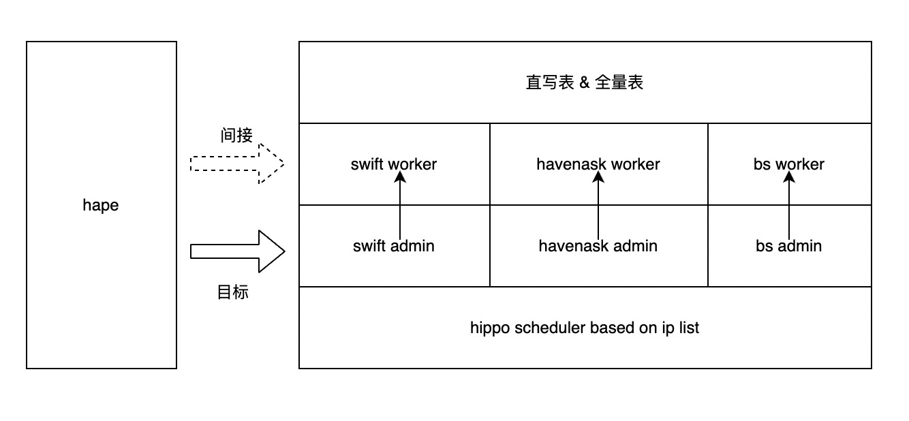

# Hape介绍
Havenask PE tools，简称hape，是havenask的简易分布式运维工具。用户可以利用hape在单台或者多台物理机上拉起分布式havenask集群，并进行基础的运维操作。

### 名词解释
* cluster
    * cluster是hape管理的基本单元，包括一个havenask集群，以及它所依赖的swift、bs集群
* hippo
    * hippo是havenask的调度系统，位于havenask/swift/bs集群的admin上（也称为appmaster）
* havenask集群
    * havenask sql在线查询引擎
    * qrs: havenask集群中的查询节点
    * searcher/database: havenask集群中的数据节点
* suez catalog与cluster服务
    * suez是havenask集群的服务框架，位于havenask集群的admin上
    * 用户通过suez的catalog服务管理表
    * 用户通过suez的cluster服务管理查询节点(qrs)和数据节点(database)
* swift集群
    * havenask的消息队列组件
* bs(buildserice)集群
    * havenask全量表离线构建集群
* 直写表
    * 直写表是指没有全量数据源，直接创建并写入数据的表
    * 对于直写表，数据经由qrs节点写入，数据整理由searcher节点自主完成
    * 直写表适用于数据结构简单，索引构建开销较小的情况，简单易用
* 全量表
    * 全量表是指有全量数据源，需要旁路将全量数据构建成全量索引并切到线上才能提供服务的表
    * 对于全量表，bs集群会启动一个索引构建流程，分别启动processor、builder、merger等进程，实时数据需要推送到swift对应的topic上（一般与表名相同），经由processor处理之后才能生效
    * 全量表适用于有全量数据源或者数据复杂，索引构建开销较大（比如向量检索场景）或者数据更新量大需要灵活调整离线处理资源的场景
### Hape基本原理

#### 进程调度
* 用户通过hape拉起admin进程
* admin进程会根据用户的集群和表目标来自动拉起一系列worker进程，监控并保证worker进程持续运行
* hape支持管理多个集群，用配置中服务名决定的zk路径和容器标识来隔离不同集群

#### 表管理
* havenask admin提供catalog和cluster两种服务
* 用户通过hape服务访问这两种服务，分别用于管理表基本信息和表部署信息
* hape的接口将catalog和cluster服务的访问封装了起来，用户不必直接对接，只需调用hape命令即可

#### 索引构建
* havenask sql表分为直写表(DIRECT表)和全量表(OFFLINE表)
* 在直写表下，用户直接通过sql语句从havenask查询节点写入数据
* 在全量表下，用户通过buildservice构建全量索引，并用过订阅swift构建实时索引

